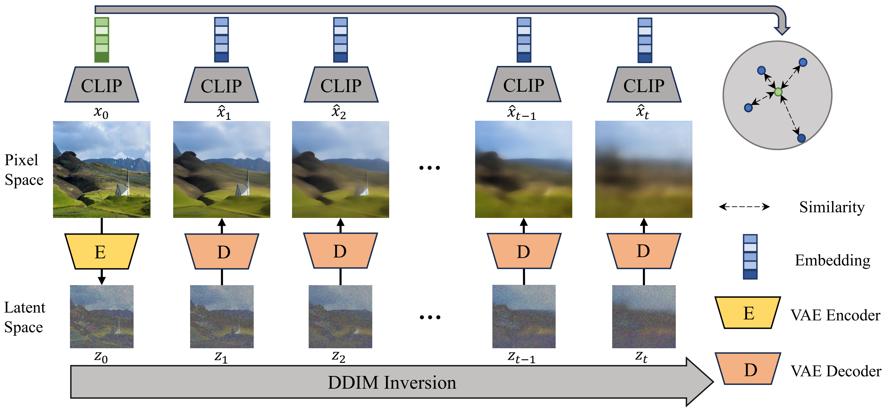

# Denoising Trajectory Analysis for Zero-Shot AI-Genenrated Image Detection

This repository is the official implementation of ```Denoising Trajectory Analysis for Zero-Shot AI-Genenrated Image Detection```.

<p align="center">
     <br>
    We perform DDIM inversion on the image, obtain the denoising outputs, and compute their similarities with the original image.
</p>


## Installation

To install requirements:

```setup
pip install -r requirements.txt
```

## Dataset

- Download the test set of [ForenSynths](https://github.com/PeterWang512/CNNDetection)
and [GenImage](https://github.com/GenImage-Dataset/GenImage) .
- We also provide the dataset of **New Generator** in the [anonymous link](https://zenodo.org/records/15468713) (**we will open both the code and dataset once our paper is accepted**).
- Please change datasets to the following structure:
```
dataset_root
|-- ForenSynths
    |-- test
        |-- gaugan
            |-- 0_real
            |-- 1_fake
        |-- progan
        |   ...
|-- GenImage
    |-- test
        |-- stable_diffusion_v_1_5
        |-- DALLE2
        |   ...
|-- New Generator
    |-- test
        |   ...
```
- Each directory (e.g., progan) contains real/fake images under ```0_real``` and ```1_fake``` folders respectively.

## Preprocessing

- Performing DDIM inversion and saving the denoising outputs:
```bash
python ddim_inversion.py --data_root $your_data_root --dataset ForenSynths --denoising_root $output_root
```
This will perform DDIM inversion on each image in the dataset
and save the denoised outputs to the ```output_root``` directory.

## Evaluation

To evaluate our method, run:

```bash
python evaluate.py --data_root $your_data_root --dataset ForenSynths --denoising_root $output_root
```

We also provide a simple demo:
```bash
python demo.py
```
This yields a similarity score for a real image and another for a generated image.

## Results
We compare our method with baselines whose source code is publicly available.
<table style="text-align: center;">
  <tr>
    <th rowspan="2">Model</th>
    <th colspan="2">ForenSynths</th>
    <th colspan="2">GenImage</th>
    <th colspan="2">New Generator</th>
    <th colspan="2">AVG</th>
  </tr>
  <tr>
    <td>Acc</td> <td>AP</td> <td>Acc</td> <td>AP</td> <td>Acc</td> <td>AP</td> <td>Acc</td> <td>AP</td>
  </tr>
  <tr>
    <td><a href="https://github.com/chuangchuangtan/NPR-DeepfakeDetection" target="_blank">NPR</a>
    </td><td>94.0</td><td>95.9</td><td>75.3</td><td>81.6</td>
    <td>78.8</td><td>86.4</td><td>82.5</td><td>87.7</td>
  </tr>
  <tr>
    <td><a href="https://github.com/chuangchuangtan/FreqNet-DeepfakeDetection" target="_blank">FreqNet</a></td>
    <td>91.9</td><td>99.0</td><td>69.8</td><td>77.5</td>
    <td>65.7</td><td>71.8</td><td>76.0</td><td>83.0</td>
  </tr>
  <tr>
    <td><a href="https://github.com/RUB-SysSec/GANDCTAnalysis" target="_blank">FreDect</a></td>
    <td>82.8</td><td>90.3</td><td>49.9</td><td>49.9</td>
    <td>42.6</td><td>45.6</td><td>58.8</td><td>62.1</td>
  </tr>
  <tr>
    <td><a href="https://github.com/peterwang512/CNNDetection" target="_blank">CNNSpot</a></td>
    <td>86.8</td><td>95.7</td><td>52.6</td><td>63.0</td>
    <td>52.4</td><td>56.8</td><td>63.9</td><td>72.1</td>
  </tr>
  <tr>
    <td><a href="https://github.com/WisconsinAIVision/UniversalFakeDetect" target="_blank">UnivFD</a></td>
    <td><strong>94.4</strong></td><td><strong>99.6</strong></td><td>64.8</td><td>83.9</td>
    <td>61.8</td><td>74.6</td><td>73.8</td><td>86.4</td>
  </tr>
  <tr>
    <td><a href="https://github.com/hzlsaber/SIDA" target="_blank">SIDA</a></td>
    <td>66.6</td><td>74.2</td><td>53.1</td><td>59.6</td>
    <td>72.9</td><td>79.4</td><td>63.3</td><td>70.1</td>
  </tr>
  <tr style="background-color: #f0f0f0;">
    <td><a href="https://github.com/jonasricker/aeroblade" target="_blank">AEROBLADE</a></td>
    <td>45.7</td><td>44.3</td><td>84.5</td><td>92.7</td>
    <td>71.8</td><td>81.9</td><td>67.9</td><td>73.5</td>
  </tr>
  <tr style="background-color: #f0f0f0;">
    <td><a href="https://github.com/JonathanBrok/Manifold-Induced-Biases-for-Zero-shot-and-Few-shot-Detection-of-Generated-Images" target="_blank">MIBD</a></td>
    <td>73.5</td><td>82.5</td><td>65.3</td><td>75.3</td>
    <td>54.8</td><td>61.9</td><td>65.0</td><td>73.9</td>
  </tr>
  <tr style="background-color: #f0f0f0;">
    <td><a href="https://github.com/TrustAIRLab/ZeroFake" target="_blank">ZeroFake</a></td>
    <td>50.4</td><td>49.1</td><td>80.4</td><td>87.9</td>
    <td>52.0</td><td>54.7</td><td>62.3</td><td>65.5</td>
  </tr>
  <tr style="background-color: #f0f0f0;">
    <td>Ours</td><td>89.9</td><td>97.4</td><td><strong>89.6</strong></td><td><strong>97.3</strong></td>
    <td><strong>92.9</strong></td><td><strong>97.8</strong></td><td><strong>90.6</strong></td><td><strong>97.5</strong></td>
  </tr>
</table>

## Acknowledge
We would like to thank [Sheng-Yu Wang](https://github.com/PeterWang512/CNNDetection),
[Ming-Jian Zhu](https://github.com/GenImage-Dataset/GenImage) and [Quentin Bammey](https://zenodo.org/records/10066460) for releasing the AI-generated image datasets.
We would also like to thank the authors of the works with publicly available source code, which made our comparisons possible.